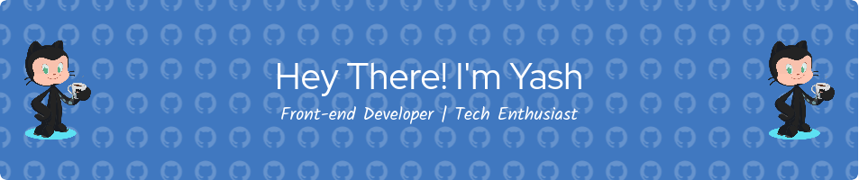

🔭 I’m currently a **Student** currently pursuing my BTECH Degree in field of Computer Science and Enginnering (CORE)
🌱 I’m passionate about Web Development and currently learning and polishing skills **React, NodeJS, NextJS, React Native**
💬 Ask me about anything or raise issue [here](https://github.com/poseidon06/poseidon06/issues)**
⚡ Currently working on a **Startup**

  
  
  
    

<h2 align="center">⚒️ Languages-Frameworks-Tools ⚒️</h2>
 

     
     

 

  <h2>🐍 My Contributions 🐍</h2>
   
  

     

<h2 align="center">⚡ Stats ⚡</h2>
 

  
  
  

  <!-- 
  

 -->

###

<!--  

  
  
  
  
  
  
  
  
  
  
  
  
  
  
  
  
  
  
  

 -->

###

###

<!-- 

  
  
  
  
  
  

### -->

###

  

  Feel free to explore my repositories and connect with me. Let's collaborate and create something amazing together!
  

###
