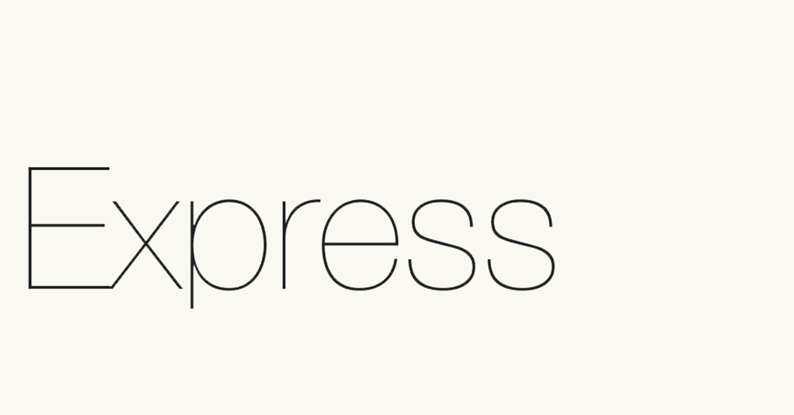
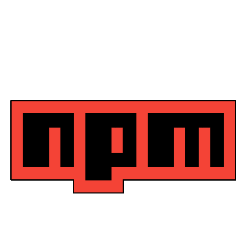
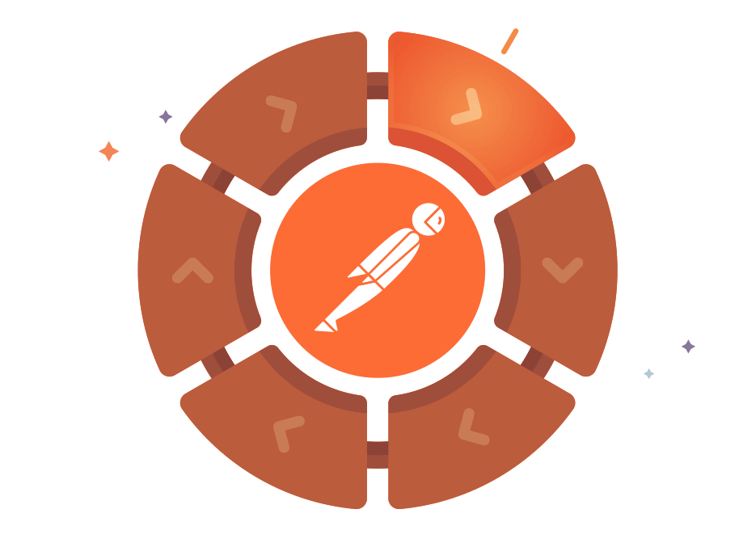
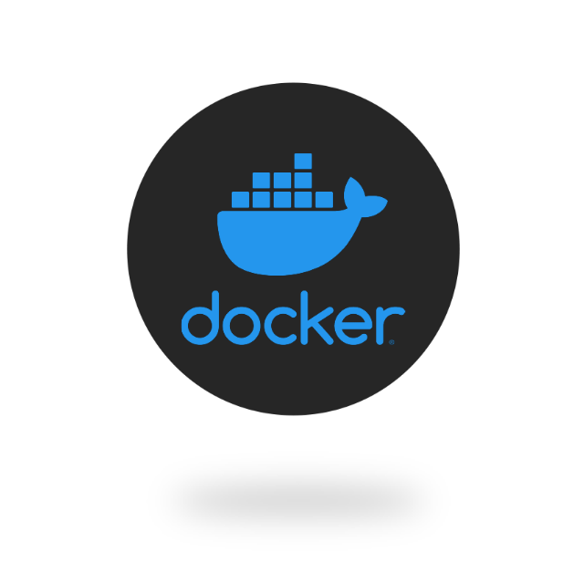
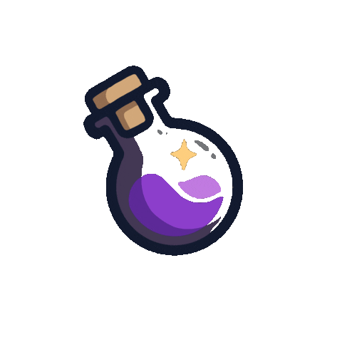
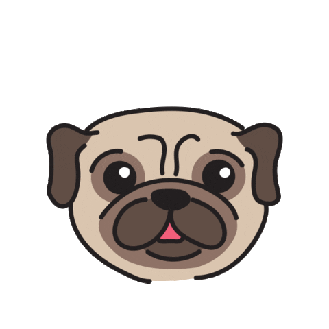

 

<!-- Description -->

🔭 Currently pursuing a **B.Tech in Computer Science & Engineering (Core)** and building my path as a **Full-Stack Software Engineer**.

🌱 Passionate about creating scalable web applications and solving real-world problems through technology. Currently sharpening my skills in **React, Node.js, Next.js, and React Native**.

💡 Exploring the intersection of **Full-Stack Development and AI** to build smarter and more impactful digital products.

⚡ Currently building and working on a **Startup**, turning ideas into real-world solutions.

💬 Feel free to connect, collaborate, or ask me anything — you can also raise an issue [here](https://github.com/yrCodem/yrCodem/issues).

<!-- 

  
  
  
    

 -->

<!-- Contact Section -->

  <!--  -->
  
  
  <!--  -->
  
  

<h2 align="center">⚒️ Languages-Frameworks-Tools ⚒️</h2>
 

<h3 align="center">⚒️ Core Tech Stack</h3>

<table align="center">
  <tr>
    <td align="center" width="96">
      
       React
    </td>
      <td align="center" width="96">
      
       Next.js
    </td>
    <td align="center" width="96">
      
       JavaScript
    </td>
    <td align="center" width="96">
      
       TypeScript
    </td>
     <td align="center" width="96">
      
       Node.js
    </td>
  </tr>

  <tr>
    <td align="center" width="96">
      
       Python
    </td>
    <td align="center" width="96">
       
       HTML
    </td>
    <td align="center" width="96">
       
       CSS
    </td>
    <td align="center" width="96">
      
       Express
    </td>
    <td align="center" width="96">
      
       Tailwind
    </td>
  </tr>

  <tr>
    <td align="center" width="96">
      
       Git
    </td>
    <td align="center" width="96">
      
       GitHub
    </td>
    <td align="center" width="96">
      
       MongoDB
    </td>
    <td align="center" width="96">
       
       NPM
    </td>
    <td align="center" width="96">
      
       Postman
    </td>
  </tr>

  <tr>
    <td align="center" width="96">
       
       AWS
    </td>
    <td align="center" width="96">
       
       Docker
    </td>
    <td align="center" width="96">
       
       Elixir
    </td>
    <td align="center" width="96">
       
       Perl
    </td>
    <td align="center" width="96">
       
       Pug
    </td>
    <td align="center" width="96"></td>
    <td align="center" width="96"></td>
  </tr>
</table>

<!-- 

     
     

 -->

<!-- 

  

 -->

<!-- Github Snapshot -->

  

<!--  

  <h2>🐍 My Contributions 🐍</h2>
   
  

     

 -->

<h2 align="center">⚡ Stats ⚡</h2>
 

  
  
  

  <!-- 
  

 -->

###
###

###

### -->

 ✍️ Dev Quote of the Day!

  

  Feel free to explore my repositories and connect with me. Let's collaborate and create something amazing together!
  

<!-- ----------------------------------------------------------------------------------------------------------------------------------- -->

